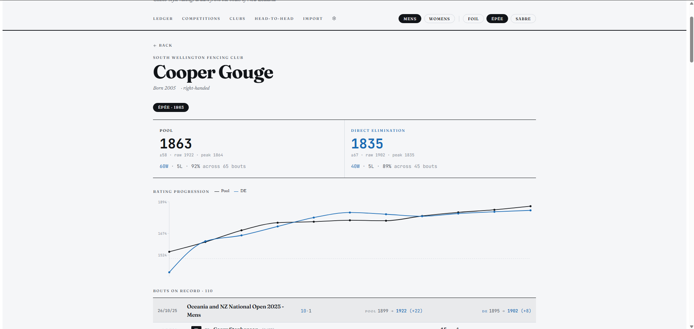

# FencingStatsNZ

A fencer-first results viewer and rating ledger for New Zealand fencing, built to run alongside (and eventually replace) the official stats portal.

---

## The problem

New Zealand's current ranking system takes each fencer's top five competition performances and sums the points. The problem is that it treats all competitions equally, a podium at the NZ Open counts the same as a podium at a small regional with a weak field. Enter enough competitions, get lucky at a few of them, and you can accumulate a ranking that doesn't reflect how you'd actually perform against the top fencers.

This came to a head during a recent team selection debate. One fencer had the results on paper to justify selection and, by the official metric, deserved it, but wasn't the strongest option for the team. The result was two proposed squads: 'the fair one' and 'he best one'. Neither felt fully defensible, and FeNZ has acknowledged that the ranking system is self-admittedly poor.

FencingStatsNZ is an attempt at something better: a system that weights wins by who you beat, separates pool-round competency from direct-elimination competency, and gives fencers and selectors a more honest basis for comparison.

---

## What it does

- **Ratings weighted by field strength** — winning against a highly-rated opponent moves your rating more than beating someone rated lower than you. A weak-field competition gives you less credit than a strong one.
- **Separate pool and DE ratings** — pool fencing and direct elimination are different skills. Each fencer carries two independent ratings per weapon, so you can see where your game actually lives.
- **Fencer profiles with rating history** — track how your ratings move across competitions and spot trends in your pool vs DE split.
- **Head-to-head comparison** — look up any two fencers' shared bout history and see a predicted win probability per stream based on current ratings.
- **Competition browser** — browse events ranked by field strength (S–D tiers based on median pool rating).
- **Clubs ledger** — clubs ranked by aggregate member ratings, with per-club detail pages.
- **Age-category rankings** — the Ledger can be filtered to Cadet, Junior, Veteran, or All to see how fencers stack up within their selection pool. Cadet/Junior eligibility uses DOB year when known and falls back to event-tag inference otherwise.
- **Canonical dataset out of the box** — every visitor loads the same up-to-date dataset on first open (served from `public/data`), with CSV import still available for personal experiments.

---

## The rating algorithm

The current implementation uses [Glicko-2](http://www.glicko.net/glicko.html) as a starting point. It handles infrequent competition schedules reasonably well, which matters for a country with NZ's calendar — and accounts for opponent strength, which the current top-five system completely ignores.

Two additions sit on top of the base algorithm:

- **Upset multiplier** — when the lower-rated fencer wins, the rating swing is amplified slightly (configurable, default 1.25×). This rewards genuine upsets more than the standard formula would.
- **Chronological rating periods** — all bouts from the same competition are processed together as one rating period before any ratings update, so earlier bouts in the day don't influence how later bouts are scored.

Glicko-2 is not necessarily the *right* algorithm for fencing. It was chosen as a reasonable placeholder, not a final decision. The plan is to experiment, gather feedback from fencers, and iterate. The algorithm's parameters are tunable from the admin panel (`/#admin`, token-gated). If you have opinions, email me or open an issue.

---

## A note on the data

FencingTimeLive recently blocked CSV exports from their results pages. To work around this, the ingest script (`ingest/fenz_ingest.py`) pulls directly from the FeNZ public API — the same data FeNZ uses to publish results on their own site. A side effect is that this gives FeNZ an incentive to keep their results up to date, since the data is only as good as what they enter.

The shipped dataset currently spans 2018–2026 and contains ~56k bouts. DE brackets in the FeNZ cache occasionally place fencer rows at the wrong slot, which would produce phantom bouts and drop real ones; the ingest now verifies adjacent pairs by score consistency, falls back to score-matching across the round, and reconstructs blank-name slots from final standings. If you spot a bout that looks wrong, open an issue with the competition and round.

---

## Running locally

```bash
cd frontend
npm install
npm run dev
```

Open `http://localhost:5173`. The dev server reads the shipped dataset from `public/data`; on a fresh checkout with no dataset, an admin can paste a CSV via `/#admin` → Import.

To regenerate the dataset from the FeNZ API:

```bash
cd ingest
pip install requests rapidfuzz
python fenz_ingest.py --since 2024-01-01 --cache ./cache --out bouts.csv
```

`bouts.csv` is what the frontend ships with — committing the regenerated file is the canonical update path. See `python fenz_ingest.py --help` for the full list of options, including `--scan` (to reach further back than the 10-competition `/latest` cap) and `--categories` (to filter by age group).

---

## Screenshot


---

## A note on my own rankings

I'm ranked #1 in NZ Juniors and #8 in Seniors — previously #1. My own rating in this system is lower than my official ranking. The system isn't built to flatter me. Its harder on fencers who've padded their points at smaller competitions.

---

FAQ

**Why is my rating different from my official FeNZ ranking?**
FeNZ's current ranking sums your top five competition placings — it weighs different events, regardless of how strong each field was. This system instead asks "who did you actually beat?" Beating top fencers raises your rating more than beating less established ones, and 'easier' competitions give you less elo than strong ones. The two systems will  disagree, especially for fencers who've competed often in smaller regional events. That's by design.

**Why are there two ratings — Pool and DE?**
Because pool fencing and direct elimination are different skills. Pool bouts are five-touch, with low stakes individually. DE bouts are fifteen-touches, with high-pressure. A fencer can be strong at one and average at the other. Treating them as one number hides where your strengths actually live. 

**Why are some fencers missing from the data?**
The dataset covers competitions registered with FeNZ from 2018 onward. If a fencer only ever competed at unregistered events, in non-FeNZ tournaments, or before 2018, they won't appear. If they've competed in registered events but are still missing, open an issue with the competition name and I'll fix it.

**Is this an official FeNZ tool?**
Not at this time. The project is developed independently and uses FeNZ's public results data. I'm in active discussion with Fencing NZ about possible collaboration.

**Why am I ranked lower than I expected?**
A few possibilities. You might have high RD (limited recent activity), in which case the system is being conservative about your rating. You might have been losing to lower-rated opponents recently, which hits ratings harder than equivalent wins help. You might be strong in DE but not pools (or vice versa). Check both ratings on your profile. Or the system might genuinely have it wrong, in which case I'd love to know. Open an issue with specifics.

**How do I report a bug or weird-looking rating?**
Email [nolanpeterson.nz@gmail.com](mailto:nolanpeterson.nz@gmail.com) or open an issue on the GitHub repo. Include: who, what tournament, what looked wrong, what you'd expect instead. Most bugs surface this way — your "this looks wrong" report is more useful than you think. Signed-in fencers can also click "Dispute" on any of their own bouts directly from their profile.

**Can I contribute?**
Yes! Open an issue on Github if you'd like to help and I'll figure out where you can fit in. Pull requests are welcome, particularly for bug fixes, data quality issues, UI improvements, and design feedback.

**Why Glicko-2?**
See DESIGN.md for the detailed reasoning. In short: Glicko-2 handles infrequent competition schedules better than Elo, and is simpler than TrueSkill while doing most of what's important for fencing. It's a starting point, not a final answer. The algorithm is replaceable and I'm open to other ideas.

**What about my privacy?**
The system displays the same information that's already publicly available on results.fencing.org.nz — fencer names, club affiliations, competition results. I don't display contact info, or anything private. If you appear in the dataset and would like to be removed, contact me and we'll work it out, though note that "remove from a public rating system" is difficult because your bouts affect other fencers' ratings — I'd anonymise rather than delete.

---

## License

MIT — see [LICENSE](LICENSE).
